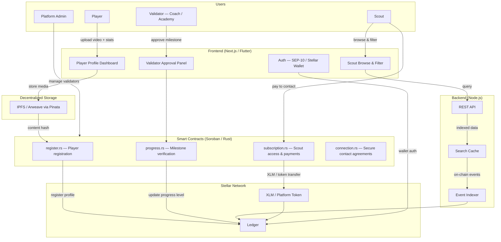
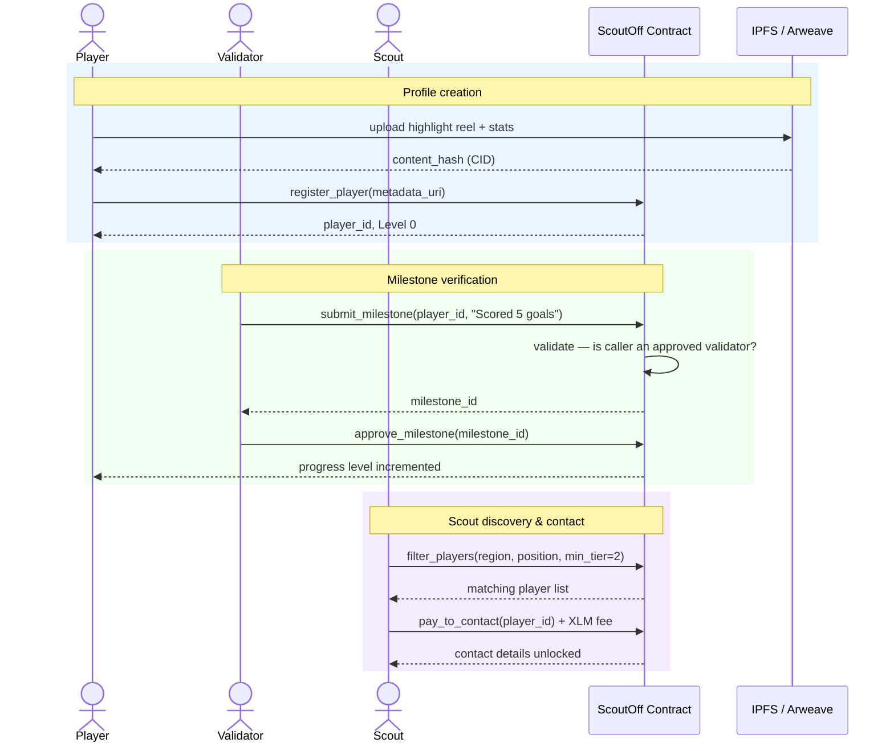

# ScoutOff

[](https://github.com/scout-off/scout-off-backend/actions/workflows/ci.yml)

Decentralized football scouting platform on Stellar — tamper-proof player profiles, on-chain progress verification, and direct scout-to-player connections powered by Soroban smart contracts.

## Overview

ScoutOff solves the visibility problem for talented footballers in underserved regions. Players build dynamic on-chain profiles backed by verified milestones — confirmed by coaches, academy directors, and certified trainers — giving scouts the confidence to act on what they see.

Stellar is the backbone: sub-cent transaction fees mean a scout in Europe can pay to contact a player in South America or Africa without hefty banking overhead, transactions settle in 3–5 seconds for a smooth mobile experience, and Soroban smart contracts make every progress update tamper-proof and auditable.

## Features

- **Dynamic Player Profiles**: On-chain identity linked to off-chain vitals, highlight reels (IPFS/Arweave), and verified stats
- **Verifiable Progress Bar**: Milestones confirmed by approved validators are written to the blockchain — no faking a progress level
- **Tiered Verification**: Four levels from unverified profile through elite tier, each requiring real-world confirmation
- **Scout Discovery**: Filter players by region, position, and verified progress tier
- **Pay-to-Contact**: Scouts pay micro-fees in XLM or a platform token to unlock premium data or initiate contact
- **Subscription Model**: Scouts can hold an active subscription for unlimited browsing within a tier
- **SEP-10 Auth**: Players and scouts log in securely with a Stellar wallet (Freighter, Albedo, or Lobstr)
- **Auth docs**: See `docs/auth.md` for SEP-10 challenge flow, JWT lifecycle, token refresh, and example requests.
- **Decentralized Storage**: Highlight reels and photos stored on IPFS; content hashes saved on-chain in the player's profile

## Architecture



### Core Components

- **register.rs**: Handles player profile creation, stores IPFS content hashes, assigns initial verification level
- **progress.rs**: Validates milestone submissions from approved validators and increments a player's progress tier
- **subscription.rs**: Manages scout subscriptions and pay-to-contact payments in XLM or platform token
- **connection.rs**: Records secure contact agreements between scouts and players on-chain
- **storage.rs**: Persistent storage for player metadata, validator registry, and scout access records
- **events.rs**: Event emission for off-chain indexing (new profiles, milestone updates, scout contacts)

### Progress Tier Model

Tiers are gated by real-world verification and enforced on-chain:

| Level | Name                  | Requirement                                                  |
|-------|-----------------------|--------------------------------------------------------------|
| 0     | Unverified            | Player creates profile and uploads data                      |
| 1     | Verified Identity     | KYC passed or academy confirms active club membership        |
| 2     | Performance Milestones| Match footage or physical stats verified by approved third party |
| 3     | Elite Tier            | Scout feedback or trial offer logged on-chain                |

Example: A validator submits "Scored 5 goals in Local Cup" → Soroban contract writes the milestone → player's progress bar updates → scouts see a tamper-proof history of when and how the player progressed.

## Tech Stack

| Layer            | Technology                        | Purpose                                                                 |
|------------------|-----------------------------------|-------------------------------------------------------------------------|
| Smart Contracts  | Rust + Soroban (Stellar)          | Player registration, progress verification, scout subscriptions, contact agreements |
| Frontend         | Next.js / Flutter                 | Player upload dashboard, scout browse interface, validator approval panel |
| Backend          | Node.js + Express                 | Event indexing, search caching, REST API for heavy queries              |
| File Storage     | IPFS / Arweave (via Pinata)       | Highlight reels, photos, and documents; hashes stored on-chain          |
| Auth             | SEP-10 (Stellar)                  | Secure wallet-based login for players and scouts                        |
| Payments         | XLM / Platform Token              | Scout subscriptions, pay-to-contact micro-fees                          |

## Smart Contract Functions

### Player Functions

- `register_player(wallet, metadata_uri, position, region)` — Create a new player profile with IPFS content hash
- `update_profile(player_id, metadata_uri)` — Update profile metadata (player auth required)
- `get_profile(player_id)` — Retrieve player profile and current progress tier

### Validator Functions

- `submit_milestone(player_id, milestone_type, evidence_uri)` — Submit a verified milestone for a player
- `approve_milestone(milestone_id)` — Approve a pending milestone, incrementing the player's progress level (validator auth required)

### Scout Functions

- `subscribe(scout, tier, duration)` — Purchase a scout subscription (XLM/token payment required)
- `pay_to_contact(scout, player_id)` — Unlock direct contact with a player (micro-fee required)
- `log_trial_offer(scout, player_id, details_uri)` — Record a trial offer on-chain, advancing player to Elite Tier

### Admin Functions

- `initialize(admin, token, platform_fee_bps)` — One-time contract setup
- `register_validator(validator_address)` — Approve a new validator (admin only)
- `revoke_validator(validator_address)` — Remove a validator (admin only)
- `pause_contract()` / `unpause_contract()` — Emergency circuit breaker (admin only)

### Query Functions

- `get_player(player_id)` — Full player profile with progress history
- `filter_players(region, position, min_tier)` — Scout discovery query
- `get_milestones(player_id)` — Tamper-proof milestone history
- `is_subscribed(scout)` — Check active scout subscription
- `health()` — On-chain health check

## Backend API Endpoints

| Method | Path | Auth | Description |
|--------|------|------|-------------|
| `GET` | `/health` | — | Liveness check — returns Stellar RPC status |
| `GET` | `/ready` | — | Readiness probe — checks IPFS and Stellar dependencies |
| `GET` | `/health/liveness` | — | Kubernetes liveness probe |
| `GET` | `/health/readiness` | — | Kubernetes readiness probe |
| `GET` | `/auth/challenge?account=G...` | — | Get SEP-10 challenge XDR to sign |
| `POST` | `/auth/token` | — | Submit signed XDR, receive JWT |
| `POST` | `/api/players/register` | — | Pin metadata to IPFS, return CID |
| `GET` | `/api/players` | — | Filter players (`region`, `position`, `minTier`) |
| `GET` | `/api/players/:playerId` | — | Single player profile |
| `GET` | `/api/players/:playerId/milestones` | — | Milestone history |
| `PUT` | `/api/players/:playerId` | Bearer (owner) | Update player profile |
| `GET` | `/api/scouts/:wallet/subscription` | Bearer | Subscription status |
| `GET` | `/api/scouts/:wallet/contacts` | Bearer | Unlocked contacts |
| `POST` | `/api/scouts/:wallet/contacts/:playerId/unlock` | Bearer | Pay-to-contact unlock |
| `GET` | `/api/scouts/:wallet/payments` | Bearer | Payment history |
| `POST` | `/api/validators/milestone` | Bearer (validator) | Pin evidence, return CID |
| `GET` | `/api/validators/milestones/pending` | Bearer (validator) | Pending milestone approvals |
| `GET` | `/api/admin/stats` | Bearer (admin) | Platform counts: players, milestones, subscriptions, events |
| `GET` | `/api/admin/events` | Bearer (admin) | All indexed contract events |
| `GET` | `/api/admin/events/export` | Bearer (admin) | Export contract events as CSV |
| `GET` | `/api/admin/fees` | Bearer (admin) | Fee withdrawal history |
| `POST` | `/api/admin/validators/register` | Bearer (admin) | Register a new validator |
| `POST` | `/api/admin/validators/revoke` | Bearer (admin) | Revoke an existing validator |
| `POST` | `/api/admin/contract/pause` | Bearer (admin) | Pause the contract (circuit breaker) |
| `POST` | `/api/admin/contract/unpause` | Bearer (admin) | Unpause the contract |
| `POST` | `/api/admin/introspect` | Bearer (admin) | Inspect JWT token claims |

> All `/api/*` routes are also available under `/api/v1/*`.

## Player Progress Flow

```
[ Player Uploads Video ]
           │
           ▼
[ Local Coach / Validator Approves ]
           │
           ▼
[ Soroban Smart Contract Updates Progress Level ] ──► [ Reflects on Scout Dashboard ]
```

### Milestone Sequence



## Progress State Machine

```
┌──────────────┐
│  Level 0     │  ← Profile created, data uploaded (Unverified)
└──────┬───────┘
       │
       ▼
┌──────────────┐
│  Level 1     │  ← Identity verified by academy or KYC
└──────┬───────┘
       │
       ▼
┌──────────────┐
│  Level 2     │  ← Performance milestones verified by approved third party
└──────┬───────┘
       │
       ▼
┌──────────────┐
│  Level 3     │  ← Scout feedback or trial offer logged (Elite Tier)
└──────────────┘
```

### Valid Transitions

| From    | To      | Trigger                                                        |
|---------|---------|----------------------------------------------------------------|
| Level 0 | Level 1 | Academy or KYC provider calls `approve_milestone` (identity)  |
| Level 1 | Level 2 | Approved validator submits and approves performance milestone  |
| Level 2 | Level 3 | Scout calls `log_trial_offer` — offer recorded on-chain       |

## Security Features

1. **Tamper-Proof History**: Every milestone is a blockchain transaction — scouts see exactly when and how a player progressed
2. **Validator Registry**: Only admin-approved validators can confirm milestones, preventing self-reporting abuse
3. **Atomic Payments**: Scout contact fees and subscription payments settle in a single transaction
4. **Authorization Checks**: All state-changing operations require proper Stellar account authorization
5. **Immutable Milestone Records**: Approved milestones cannot be altered or deleted post-confirmation
6. **Circuit Breaker**: Admin can pause the contract in an emergency without losing state

## Quick Start

### 1. Install Dependencies

```bash
npm install
```

### 2. Build Smart Contracts

```bash
cd contracts
cargo build --release   # .cargo/config.toml defaults target to wasm32-unknown-unknown
stellar contract optimize --wasm target/wasm32-unknown-unknown/release/register.wasm
```

The workspace contains four Soroban contracts (`register`, `progress`, `subscription`, `connection`) and a `shared` utility crate. All compile to WASM stubs ready for business-logic implementation (see issues #197–#202).

### 3. Deploy to Testnet

```bash
stellar contract deploy \
  --wasm target/wasm32-unknown-unknown/release/scout_off.optimized.wasm \
  --source deployer \
  --network testnet
```

### 4. Initialize Contract

```bash
stellar contract invoke \
  --id <CONTRACT_ID> \
  --source deployer \
  --network testnet \
  -- \
  initialize \
  --admin <ADMIN_ADDRESS> \
  --token <XLM_OR_TOKEN_ADDRESS> \
  --platform_fee_bps 500
```

### 5. Run the Backend

```bash
cp .env.example .env
# fill in CONTRACT_ID, JWT_SECRET, HORIZON_URL, SOROBAN_RPC_URL, PINATA_API_KEY, etc.
npm install
npm run dev
```

**Available npm scripts:**

| Script | Command | Description |
|--------|---------|-------------|
| `npm run dev` | `ts-node-dev --respawn --transpile-only src/index.ts` | Start with hot-reload for development |
| `npm run build` | `tsc` | Compile TypeScript to `dist/` |
| `npm start` | `node dist/index.js` | Run the compiled server (run `build` first) |
| `npm test` | `jest --runInBand` | Run the test suite |
| `npm run lint` | `eslint 'src/**/*.ts' 'tests/**/*.ts' --ext .ts` | Run TypeScript linting |

On startup the server will:
- Open (or create) a SQLite database at `DB_PATH` (default: `scout-off.db`)
- Begin polling Soroban for contract events every 5 seconds
- Fail fast if `CONTRACT_ID` or `JWT_SECRET` are missing

See [DEPLOYMENT.md](DEPLOYMENT.md) for complete deployment instructions.

## Docker

The fastest way to run the backend locally. No Node.js installation required — Docker handles everything.

### Prerequisites

- [Docker Desktop](https://www.docker.com/products/docker-desktop/) (includes both `docker` and `docker compose`)

### Start the service

```bash
docker compose up
```

This will:

1. Build a multi-stage image (TypeScript compilation in the builder stage, lean Alpine runtime)
2. Start the backend on **port 4000**
3. Create a named volume (`scout_db`) so the SQLite database survives restarts

The API is ready when you see:

```
scout-off-backend  | {"level":"info","msg":"ScoutOff backend running on port 4000 [testnet]"}
```

Verify it's up:

```bash
curl http://localhost:4000/health/liveness
# → {"status":"ok"}
```

### Required variables before going further

The `docker-compose.yml` ships with sensible defaults so the service starts without changes. Both required variables have placeholder values that satisfy the startup check. Update them in `docker-compose.yml` (or override with a local `.env` file) when you're ready to connect to a real contract:

| Variable | Default in compose | Description |
|----------|--------------------|-------------|
| `CONTRACT_ID` | `PLACEHOLDER_REPLACE_WITH_REAL_CONTRACT_ID` | Your deployed ScoutOff Soroban contract address |
| `JWT_SECRET` | `change-me-to-a-long-random-secret-at-least-32-chars` | Secret for signing JWTs — generate with `openssl rand -hex 32` |

### Run in the background (detached)

```bash
docker compose up -d
```

View logs at any time:

```bash
docker compose logs -f
```

### Stop the service

```bash
docker compose down
```

SQLite data is preserved in the `scout_db` volume. To also delete the volume and start fresh:

```bash
docker compose down -v
```

### Build the image standalone

```bash
docker build -t scout-off-backend .
```

Run it with environment variables:

```bash
docker run --rm \
  -p 4000:4000 \
  -v scout_db:/data \
  -e CONTRACT_ID=your_contract_id \
  -e JWT_SECRET=your_secret \
  scout-off-backend
```

### Customise the port

Set `PORT` in `docker-compose.yml` or prefix the command:

```bash
PORT=5000 docker compose up
```

The host port mapping follows the `PORT` variable; the container always listens on 4000 internally.

## Backend Local Development

This section covers everything you need to get the backend running locally.

### Prerequisites

- Node.js ≥ 18
- npm ≥ 9

### Install Dependencies

```bash
npm install
```

### Environment Setup

Copy the example env file and fill in the required values:

```bash
cp .env.example .env
```

Required environment variables (the server will fail to start without these):

| Variable | Description |
|----------|-------------|
| `CONTRACT_ID` | Deployed ScoutOff Soroban contract address |
| `JWT_SECRET` | Secret used to sign SEP-10 JWT tokens |

Optional but commonly set:

| Variable | Default | Description |
|----------|---------|-------------|
| `PORT` | `4000` | Backend API port |
| `HORIZON_URL` | Stellar testnet | Stellar Horizon endpoint |
| `SOROBAN_RPC_URL` | Stellar testnet | Soroban RPC endpoint |
| `PINATA_API_KEY` / `PINATA_SECRET` | — | IPFS upload credentials |
| `DB_PATH` | `scout-off.db` | SQLite database file path |
| `LOG_LEVEL` | `info` | Log verbosity: `debug`, `info`, `warn`, `error` |

See [.env.example](.env.example) for the full list of supported variables.

### Run (Development)

```bash
npm run dev
```

Hot-reload is enabled via `ts-node-dev`. The server restarts automatically on file changes.

### Build

```bash
npm run build
```

Compiles TypeScript to `dist/`. Run the compiled output with `npm start`.

### Run Tests

```bash
npm test
```

Runs the full backend test suite with Jest. Tests are located in the [`tests/`](tests/) directory, organised by layer:

- [`tests/middleware/`](tests/middleware/) — middleware unit tests (auth, correlationId, errorHandler, etc.)
- [`tests/routes/`](tests/routes/) — route integration tests (health, scout, admin, etc.)
- [`tests/utils/`](tests/utils/) — utility unit tests (CID validator, tier, logger, etc.)
- [`tests/services/`](tests/services/) — service unit tests (IPFS, indexer, SEP-10, etc.)

### Lint

```bash
npm run lint
```

## Health Endpoints

The backend exposes two health check endpoints for monitoring and orchestration probes.

| Method | Path | Auth | Description |
|--------|------|------|-------------|
| `GET` | `/health` | — | Liveness check — always returns `200 ok` with optional Stellar RPC status |
| `GET` | `/ready` | — | Readiness probe — returns `200` when all dependencies are reachable, `503` when degraded |

### GET /health

Liveness check. Returns `200` as long as the process is running.

Optionally includes a Stellar RPC connectivity check, controlled by the `STELLAR_HEALTH_CHECK_ENABLED` env var (default: `true`).

**Middleware module:** `src/services/stellar.ts` (`stellarHealth`)

**Example response (healthy):**
```json
{
  "status": "ok",
  "healthStatus": {
    "stellar": "ok"
  }
}
```

**Example response (Stellar disabled):**
```json
{
  "status": "ok",
  "healthStatus": {
    "stellar": "disabled"
  }
}
```

> **Monitoring note:** Use `/health` as a liveness probe. A non-`200` response indicates the process has crashed and should be restarted.

### GET /ready

Readiness probe. Returns `200` when all service dependencies are reachable. Returns `503` when any dependency is unavailable.

Currently checks: **IPFS (Pinata)** storage connectivity.

**Middleware module:** `src/services/ipfs.ts` (`checkHealth`)

**Example response (ready):**
```json
{
  "status": "ok",
  "services": {
    "ipfs": "ok"
  }
}
```

**Example response (degraded):**
```json
{
  "status": "degraded",
  "services": {
    "ipfs": "unavailable"
  }
}
```

> **Monitoring note:** Use `/ready` as a readiness probe. A `503` response means the service should be temporarily removed from the load balancer until dependencies recover.

### Dependencies

| Endpoint | Dependency | Stub / Module |
|----------|-----------|---------------|
| `/health` | Stellar RPC (`SOROBAN_RPC_URL`) | `src/services/stellar.ts` — `stellarHealth()` |
| `/ready` | IPFS / Pinata (`PINATA_API_KEY`) | `src/services/ipfs.ts` — `checkHealth()` |

Both dependency checks are stubbed in tests — see `tests/routes/health.test.ts`.

### IPFS Service Dependency

The backend uses [Pinata](https://pinata.cloud) to pin player metadata and milestone evidence to IPFS. The service is **optional in local development** — when `PINATA_API_KEY` and `PINATA_SECRET` are not set, `pinJson`, `pinFile`, and `checkHealth` fall back to deterministic stub behaviour and log a `[warn]` on each call. No network requests are made.

In **production** (`NODE_ENV=production`) the same functions throw immediately if the credentials are absent, preventing silent data loss.

| Env var | Required | Description |
|---------|----------|-------------|
| `PINATA_API_KEY` | production only | Pinata API key |
| `PINATA_SECRET` | production only | Pinata secret key |
| `PINATA_GATEWAY` | no | Public gateway base URL (default: `https://gateway.pinata.cloud`) |

## How It Works

1. **Player Onboarding**
   - Connect Freighter wallet (SEP-10 auth)
   - Fill out profile: position, region, age, club
   - Upload highlight reels → stored on IPFS via Pinata
   - Call `register_player` — profile minted on Stellar ledger at Level 0

2. **Milestone Verification**
   - Coach or academy director submits a milestone (e.g., "Top speed 32 km/h")
   - Approved validator calls `approve_milestone` on-chain
   - Player's progress tier increments — visible immediately on scout dashboard

3. **Scout Discovery**
   - Scout subscribes or pays per contact in XLM
   - Filters players by region, position, and minimum verified tier
   - Views tamper-proof milestone history before deciding to reach out
   - Calls `pay_to_contact` — micro-fee settles in seconds, contact details unlocked

4. **Trial Offer Logging**
   - Scout submits a trial offer via `log_trial_offer`
   - Contract records the offer on-chain, advancing player to Elite Tier (Level 3)
   - Both parties have an immutable record of the agreement

5. **Admin / Validator Management**
   - Admin registers trusted validators (coaches, academies, certified trainers)
   - Admin monitors platform fees and calls `withdraw_fees` to collect revenue
   - Emergency `pause_contract` available as a circuit breaker

## Configuration

### Key Environment Variables

| Variable                  | Description                                         |
|---------------------------|-----------------------------------------------------|
| `CONTRACT_ID`             | Deployed ScoutOff contract address (**required**)   |
| `JWT_SECRET`              | Secret used to sign SEP-10 JWT tokens (**required**)|
| `HORIZON_URL`             | Stellar Horizon endpoint                            |
| `SOROBAN_RPC_URL`         | Soroban RPC endpoint                                |
| `NETWORK`                 | `testnet` or `mainnet`                              |
| `NETWORK_PASSPHRASE`      | Stellar network passphrase (auto-set by `NETWORK`)  |
| `PINATA_API_KEY`          | Pinata API key for IPFS uploads                     |
| `PINATA_SECRET`           | Pinata secret                                       |
| `PLATFORM_FEE_BPS`        | Platform fee in basis points (default: 500)         |
| `PORT`                    | Backend API port (default: 4000)                    |
| `DB_PATH`                 | SQLite database file path (default: `scout-off.db`) |
| `LOG_LEVEL`               | Log verbosity: `debug`, `info`, `warn`, `error` (default: `info`) |
| `ADMIN_WALLET`            | Stellar address of the platform admin; automatically granted admin role on token exchange |
| `STELLAR_HEALTH_CHECK`    | Set to `false` to disable Stellar RPC check in `/health` (default: `true`) |
| `JSON_PAYLOAD_LIMIT`      | Maximum JSON request body size (default: `1mb`); requests exceeding limit return HTTP 413 |
| `RATE_LIMIT_ENABLED`      | Set to `false` to disable rate limiting (default: `true`) |
| `RATE_LIMIT_WINDOW_MS`    | Rate limit window in milliseconds (default: `60000`) |
| `RATE_LIMIT_MAX`          | Max requests per window (default: `60`)             |
| `WEBHOOK_ENABLED`         | Set to `true` to enable event webhooks (default: `false`) |
| `WEBHOOK_URL`             | Endpoint to POST contract events to when `WEBHOOK_ENABLED=true` |

## Testing

```bash
# Smart contract tests (contracts/ not yet implemented — see #216)
# cd contracts && cargo test

# Backend tests
npm run test
```

Backend test coverage includes:
- ✅ Player registration and IPFS metadata pinning
- ✅ Milestone submission and pending milestone queries
- ✅ Scout subscription status and contact unlock flow
- ✅ Admin stats, events, validator management endpoints
- ✅ SEP-10 challenge and token exchange
- ✅ Auth middleware (requireAuth, requireRole, requireOwner)
- ✅ Rate limiting, payload size limits, correlation IDs
- ✅ Health and readiness probes

## MVP Scope

The initial testnet MVP focuses on a single end-to-end flow:

1. One player registers a profile and uploads a highlight reel → IPFS hash stored on-chain
2. One validator approves a milestone → player progress increments to Level 2
3. One scout pays a micro-fee → contact details unlocked

Everything else (subscriptions, trial offer logging, fractionalized sponsorship) ships in subsequent milestones.

## Roadmap

- [x] Player profile registration on Stellar testnet
- [x] Validator-approved milestone system
- [x] Scout discovery filters (region, position, tier)
- [ ] Pay-to-contact micro-fee flow
- [ ] Scout subscription model
- [ ] Trial offer logging (Elite Tier promotion)
- [ ] Mobile frontend (Flutter)
- [ ] Fractionalized player sponsorship via Player Tokens
- [ ] Mainnet launch

## Why Stellar

- **Microtransactions**: Scouts pay fractions of a cent to unlock data or contact players — no banking fees across borders
- **Speed**: Transactions settle in 3–5 seconds, critical for players on low-end mobile devices
- **Future Expansion**: Fractionalized sponsorship — fans buy "Player Tokens" to fund a young player's training; if the player turns professional, a percentage of their transfer fee routes back to token holders via Soroban

## Error Codes

| Code | Error               | Description                              | Resolution                                      |
|------|---------------------|------------------------------------------|-------------------------------------------------|
| 1    | AlreadyInitialized  | Contract already initialized             | No action needed; contract is ready             |
| 2    | NotInitialized      | Contract not initialized                 | Admin must call `initialize` first              |
| 3    | PlayerNotFound      | Player ID does not exist                 | Verify player_id from registration transaction  |
| 4    | InvalidValidator    | Caller is not a registered validator     | Admin must register the validator first         |
| 5    | MilestoneNotFound   | Milestone ID does not exist              | Refresh milestone list                          |
| 6    | AlreadyVerified     | Milestone already approved               | No duplicate approvals needed                   |
| 7    | InsufficientFee     | Payment below required contact fee       | Check current fee via `get_contact_fee()`       |
| 8    | NotSubscribed       | Scout has no active subscription         | Call `subscribe` before browsing premium data   |
| 9    | Unauthorized        | Caller is not authorized for this action | Confirm you are using the correct Stellar account |
| 10   | ContractPaused      | Contract is paused                       | Wait for admin to unpause                       |
| 11   | Overflow            | Arithmetic overflow in fee calculation   | Use amounts within safe u128 range              |

## Events

| Event               | Emitted When                                              |
|---------------------|-----------------------------------------------------------|
| `player_registered` | New player profile created on-chain                       |
| `milestone_submitted` | Validator submits a new milestone for review            |
| `milestone_approved`  | Validator approves milestone; progress tier incremented |
| `scout_subscribed`    | Scout purchases an active subscription                  |
| `contact_unlocked`    | Scout pays to unlock player contact details             |
| `trial_offer_logged`  | Scout logs a trial offer; player promoted to Elite Tier |
| `fees_withdrawn`      | Admin withdraws accumulated platform fees               |

## Dependencies

- `@stellar/stellar-sdk = "12.1.0"` — Stellar JS SDK
- `express = "4.18.2"` — Backend API server
- `better-sqlite3 = "9.4.3"` — SQLite database
- `jsonwebtoken = "9.0.2"` — JWT signing and verification
- `axios = "1.6.8"` — HTTP client for IPFS/Pinata
- `node-fetch = "^2.7.0"` — HTTP client (legacy fetch support)
- `zod = "3.23.8"` — Request validation
- `form-data = "4.0.0"` — Multipart uploads to Pinata

## License

MIT

## Support

- GitHub Issues: [Create an issue](https://github.com/scout-off/scout-off-backend/issues)
- Stellar Discord: https://discord.gg/stellar
- Stellar Developers: https://developers.stellar.org

## Contributing

Contributions are welcome! This section provides guidance for backend contributors and issue filing best practices.

### Getting Started

1. **Onboarding via Drips Funding Wave Program**  
   ScoutOff is part of the Drips funding wave program. If you're a contributor interested in joining, visit [drips.network](https://drips.network) to learn about opportunities and register your interest. Funded contributors receive support through the Drips platform.

2. **Fork and Set Up**
   ```bash
   git clone https://github.com/scout-off/scout-off-backend.git
   cd scout-off-backend
   npm install
   npm run dev
   ```

3. **Pre-Contribution Checks**
   - All contract tests pass: `cargo test`
   - All backend tests pass: `npm run test`
   - New features include tests and updated documentation
   - Milestone verification logic changes require explicit review
   - ⚠️ **Security audits pass**: `npm audit` (see [Security & Dependency Review](#security--dependency-review) below)

### Security & Dependency Review

**All contributors must audit third-party dependencies for security vulnerabilities before submitting pull requests.** Given ScoutOff's handling of blockchain payments and user authentication, supply chain security is critical.

#### Regular Dependency Audits

Run `npm audit` **before every commit** and before opening a PR:

```bash
npm audit
```

**Actions by vulnerability level:**

| Severity | Action |
|----------|--------|
| **Critical / High** | Must fix before merging — block the PR if necessary |
| **Moderate** | Fix unless infeasible; document trade-offs in PR |
| **Low** | Document; fix in next sprint if no workaround exists |

#### Dependency Update Checks

When updating dependencies (especially those marked ⭐ below), verify:

1. **No breaking changes** — Review the package's CHANGELOG
2. **All tests pass** — Run `npm run test && npm run lint && npm audit`
3. **Critical dependencies audited** — Pay special attention to:
   - `express` — Web framework handling auth and requests
   - `@stellar/stellar-sdk` — Direct blockchain interaction
   - `jsonwebtoken` — JWT tokens for session management
   - `better-sqlite3` — User data persistence
   - `axios` / `node-fetch` — External API calls (IPFS, Stellar)

#### Commit Message Convention

Include dependency changes in commit messages:

```bash
git commit -m "chore: update @stellar/stellar-sdk to 12.2.0

- Update from 12.1.0 to 12.2.0
- Fixes RPC error handling vulnerability
- All tests pass; no breaking changes

Fixes #456"
```

#### Reporting Security Issues

**Do NOT open a public GitHub issue for security vulnerabilities.** Email maintainers privately with proof-of-concept (if safe to share). Allow 7 days for a response before public disclosure.

---

**For comprehensive contributing guidelines, including code quality standards, workflow, and issue templates, see [CONTRIBUTING.md](CONTRIBUTING.md).**

### Filing Backend Issues

We track ~125 active issues across the ScoutOff platform. Use the guidelines below to help us prioritize and route your contribution efficiently.

#### Issue Categories

When filing an issue, select one of these categories (via GitHub labels):

| Category        | Description                                           | Examples |
|-----------------|-------------------------------------------------------|----------|
| **bug**         | Unintended behavior or crashes in existing features   | IPFS timeout on upload; SEP-10 auth fails |
| **feature**     | New capability or enhancement to existing behavior    | Add player region filter; support trial offer logging |
| **performance** | Optimization or speed improvements                    | Cache layer for milestone queries; reduce indexer latency |
| **documentation** | Updates to README, API docs, or code comments       | Clarify error codes; add SDK usage examples |
| **refactor**    | Code restructuring without changing behavior          | Consolidate validation logic; reduce middleware complexity |
| **infra**       | Deployment, CI/CD, or DevOps improvements            | GitHub Actions optimization; database migration tooling |
| **security**    | Vulnerability fixes or hardening                      | Validate JSON inputs; rate limit on auth endpoints |
| **test**        | Test coverage or reliability improvements            | Add contract edge case tests; improve test isolation |

#### Priority Levels

Priority is assigned by maintainers based on impact and timeline:

| Priority | Severity | Timeline | Example |
|----------|----------|----------|---------|
| **P0** (Critical) | Blocks deployment or causes data loss | Fix immediately | Contract initialization fails; database corruption |
| **P1** (High) | Affects core user flow or many users | Fix within sprint | Milestone approval broken; payment processing hangs |
| **P2** (Medium) | Degrades experience but has workaround | Schedule next sprint | Scout search is slow; validator list stale |
| **P3** (Low) | Nice-to-have or affects few users | Plan in backlog | Improve error message wording; refactor rarely-used module |

#### How to File a High-Quality Issue

1. **Check Existing Issues First**  
   Search [GitHub Issues](https://github.com/scout-off/scout-off-backend/issues) to avoid duplicates.

2. **Use a Clear Title**  
   ✅ *"Auth token expires before subscription ends"*  
   ❌ *"Bug with tokens"*

3. **Provide Steps to Reproduce** (for bugs)  
   ```
   1. Create a scout account
   2. Purchase a 30-day subscription via /api/scouts/subscribe
   3. Wait 25 days
   4. Call /api/scouts/:wallet/subscription
   
   Expected: subscription still active
   Actual: returns 401 NotSubscribed
   ```

4. **Include Environment Context**  
   - OS and Node version: `node -v && npm -v`
   - Backend service versions: `npm list express @stellar/stellar-sdk`
   - Relevant config (without secrets): `NETWORK=testnet`

5. **Add Labels**  
   Assign the issue category (e.g., `bug`, `feature`, `performance`) and any applicable priority you estimate. Maintainers will confirm priority.

6. **Link Related Issues**  
   If fixing this resolves another issue, mention it: *"Fixes #123"* or *"Related to #456"*.

#### Issue Submission Template

```markdown
## Summary
One sentence describing the issue.

## Category
[ ] Bug [ ] Feature [ ] Performance [ ] Documentation [ ] Refactor [ ] Infra [ ] Security [ ] Test

## Priority (Estimated)
[ ] P0 – Blocks deployment [ ] P1 – High impact [ ] P2 – Medium [ ] P3 – Low

## Environment
- Node: vX.Y.Z
- Backend: [list key versions from package.json]
- Network: [testnet/mainnet/local]

## Description
Detailed explanation of what you're reporting or proposing.

## Steps (for bugs)
1.
2.
3.

## Expected vs. Actual (for bugs)
- Expected: …
- Actual: …

## Proposed Solution (for features)
How would you implement this?

## Related Issues
Fixes #XXX / Related to #YYY
```

### Contribution Workflow

1. **Claim an Issue**  
   Comment on the issue to indicate you're working on it. Maintainers will assign it to you.

2. **Create a Feature Branch**  
   ```bash
   git checkout -b add-your-feature-description
   ```

3. **Make Changes and Test Locally**  
   ```bash
   npm run test           # Run backend tests
   npm run lint           # Check code style
   npm run dev            # Test manually
   ```

4. **Commit with Clear Messages**  
   ```bash
   git commit -m "fix: resolve auth token expiration bug

   - Add expiry check in subscription validator
   - Extend token TTL to match subscription period
   - Add test case for 30-day subscription renewal
   
   Fixes #123"
   ```

5. **Push and Open a Pull Request**  
   ```bash
   git push origin add-your-feature-description
   ```
   Reference the issue in the PR description: *"Fixes #123"*

6. **Review and Merge**  
   - Maintainers review code and tests
   - Address feedback in new commits (don't force-push)
   - Once approved, your PR will be merged to `main`

### Code Quality Standards

- **Tests**: New features must include unit or integration tests
- **Linting**: Run `npm run lint` and fix all warnings
- **Types**: Use strict TypeScript; avoid `any` types where possible
- **Documentation**: Update README if your changes affect user-facing behavior
- **Git History**: Use atomic commits with meaningful messages

### Getting Help

- **Questions about an issue?** Comment on the GitHub issue
- **Need design feedback?** Open a draft PR early
- **Stuck debugging?** Reach out on [Stellar Discord](https://discord.gg/stellar) or file a help-wanted issue
- **Contributing via Drips?** Visit the [Drips contributor portal](https://drips.network) for wave-specific guidance

Please see [CONTRIBUTING.md](CONTRIBUTING.md) for additional guidelines.
